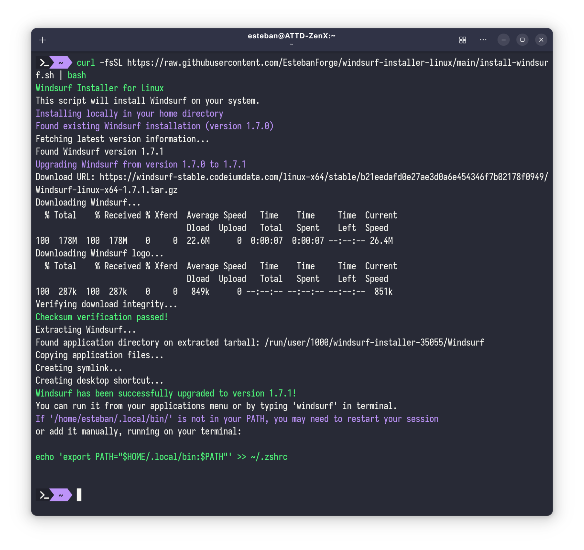

# Windsurf Linux Installer

Scripts to install/update/uninstall [Windsurf Code Editor](https://windsurf.com) on Linux. It automates the process of downloading, extracting, and installing the application, as well as setting up the necessary environment variables and symlinks for terminal access.

Made for non-deb based Linux distributions, such as Arch Linux, Fedora, and others.

Tested on Fedora 41.

<div style="text-align: center;">
  
</div>

## Why?

Because Exafunction forgot that Debian/Ubuntu aren't the only Linux distributions out there.

This script is a workaround for those who want to use Windsurf on other distributions without having to manually download, extract, symlink, set paths and add a desktop entry with the correct icon.

## Installation

This will download the latest version of Windsurf in tarball format, extract it, and set up the necessary environment variables and symlinks for terminal usage.

```bash
curl -fsSL https://raw.githubusercontent.com/EstebanForge/windsurf-installer-linux/main/install-windsurf.sh | bash
```

Or download the script and run it manually:

```bash
curl -O https://raw.githubusercontent.com/EstebanForge/windsurf-installer-linux/main/install-windsurf.sh && chmod +x install-windsurf.sh && ./install-windsurf.sh
```

## Updates

To update Windsurf, you can run the installation script again. It will check for the latest version and update it if necessary.

See above for the installation command.

## Uninstallation

To uninstall Windsurf you can use the provided uninstall script. This will remove the application and clean up any symlinks created during installation.

```bash
curl -fsSL https://raw.githubusercontent.com/EstebanForge/windsurf-installer-linux/main/uninstall-windsurf.sh | bash
```

Or download the script and run it manually:

```bash
curl -O https://raw.githubusercontent.com/EstebanForge/windsurf-installer-linux/main/uninstall-windsurf.sh && chmod +x uninstall-windsurf.sh && ./uninstall-windsurf.sh
```

# License
This project is licensed under the MIT License. See the [LICENSE](LICENSE) file for details.

# Disclaimer
This script is provided as-is without any warranty. Use it at your own risk. The author is not responsible for any issues that may arise from using this script.

